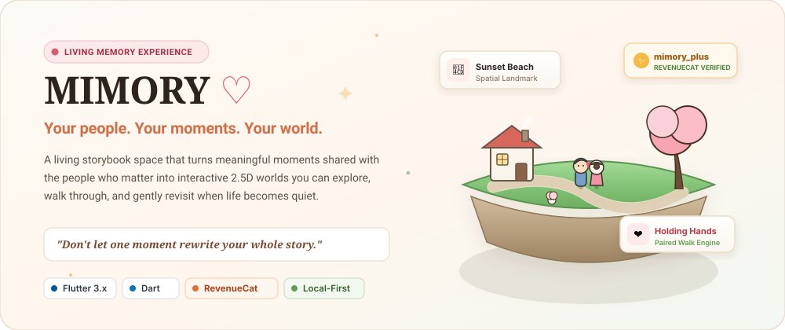

<div align="center">



<br/>

<a href="https://github.com/Noufalthecoder/mimory"></a>
<a href="https://github.com/Noufalthecoder/mimory"></a>
<a href="https://github.com/Noufalthecoder/mimory"></a>
<a href="https://github.com/Noufalthecoder/mimory"></a>
<a href="https://github.com/Noufalthecoder/mimory"></a>
<a href="https://github.com/Noufalthecoder/mimory"></a>

<br/><br/>

[**Product Vision**](#a-memory-shouldnt-disappear-into-a-camera-roll) • [**System Architecture**](#system-architecture) • [**Memory Walk Engine**](#memory-walk-spatial-engine) • [**RevenueCat Monetization**](#revenuecat--mimory-monetization) • [**Verification**](#verification--test-suite) • [**Quickstart**](#getting-started)

</div>

---

## A memory shouldn't disappear into a camera roll.

People accumulate thousands of meaningful moments with the people who matter most—partners, best friends, and family. Yet today, those memories end up trapped in flat, chronological camera rolls or social feeds designed for public metrics rather than personal intimacy.

**MIMORY gives those moments a place to live.**

Instead of scrolling through an endless grid of timestamps, MIMORY lets you build dedicated storybook worlds for your relationships. Memories become physical landmarks along scenic paths, weather changes with real-world time and seasons, and the world visibly blooms and expands as your shared story deepens.

<br/>

<div align="center">
  
</div>

<br/>

---

## The Core Product Experience

<table>
  <tr>
    <td width="50%" valign="top">
      <h3>🏡 1. Dedicated Relationship Worlds</h3>
      <p>Create separate, personal worlds for each relationship (Partner, Best Friend, Family). Choose from distinct themes including <i>Cozy Town</i>, <i>Starlit Forest</i>, <i>Blooming Meadow</i>, and <i>Sunlit Valley</i> with customizable chibi avatars.</p>
    </td>
    <td width="50%" valign="top">
      <h3>📸 2. Keepsake Photo &amp; Story Preservation</h3>
      <p>Preserve milestones as photo keepsakes or written story vignettes. Photos are persisted locally in app-controlled sandbox storage, surviving device restarts and OS updates.</p>
    </td>
  </tr>
  <tr>
    <td width="50%" valign="top">
      <h3>🚶‍♀️ 3. 2.5D Interactive Memory Walk</h3>
      <p>Explore your world using a responsive 360° virtual joystick. Stroll along cobblestone paths, follow directional signposts pointing to past memories, and hold hands with your companion character.</p>
    </td>
    <td width="50%" valign="top">
      <h3>📍 4. Proximity Landmark Reliving</h3>
      <p>As you approach memory landmarks in the world, they illuminate with subtle proximity glows. Tapping a landmark smoothly presents the keepsake sheet with its story, date, and original photo.</p>
    </td>
  </tr>
  <tr>
    <td width="50%" valign="top">
      <h3>🌤️ 5. Real-Time Atmospheric Conditions</h3>
      <p>Worlds reflect natural time cycles (Morning, Day, Sunset, Night) and seasonal weather (Rain with shared umbrellas, Winter snowfall with cozy accessories, and evening fireflies).</p>
    </td>
    <td width="50%" valign="top">
      <h3>✨ 6. Organic World Expansion</h3>
      <p>As you add memories, the world dynamically scales its terrain boundaries, environmental flora density, and companion animal behaviors.</p>
    </td>
  </tr>
</table>

---

## System Architecture

MIMORY is engineered as a local-first, modular Flutter application with strict domain separation, reactive service orchestration, and verified entitlement monetization.

<br/>

<div align="center">
  
</div>

<br/>

### Architectural Principles

- **Presentation Layer (`lib/features/`)**: Self-contained feature modules managing screen lifecycles, user inputs, and navigation without coupling to data storage mechanisms.
- **Core Design Tokens (`lib/core/`)**: Unified storybook design system with tactile pill buttons, custom text fields, and soft elevation tokens in `AppTheme`.
- **Domain State Singletons (`lib/services/`)**: `WorldService` orchestrates user session, world management, and 1:N memory relations. `RevenueCatService` evaluates verified entitlement streams.
- **Local-First Reliability**: `StorageService` serializes data to `SharedPreferences` while `path_provider` sandboxes high-resolution photos in `/mimory_photos/`, eliminating mandatory cloud dependencies.

---

## Memory Walk: Spatial Engine

Memory Walk transforms abstract dates into an explorable spatial journey using custom mathematical projection on Flutter's Canvas API.

<br/>

<div align="center">
  
</div>

<br/>

### Spatial Math Highlights

1. **3D Perspective Camera (`Camera3D`)**: Projects 3D world coordinates `(x, y, z)` into screen space `(dx, dy)` using focal length (`500.0`) and pitch angles (`0.35 rad`), applying painter's algorithm depth sorting and distance-based scaling (`scale = focal / depth`).
2. **Smooth Follow with Soft Dead-Zone**: A cinematic camera dead-zone (`dx: 20`, `dy: 25`) absorbs small joystick micro-movements, preventing camera jitter while smoothly following players via damped lag interpolation (`lagT = 0.15`).
3. **Synchronized Paired Controller**: Custom `CustomPainter` character models synchronize leg swing cycles, direction facing, shared umbrella holding during rain, and hand-holding positions.

---

## RevenueCat & MIMORY+ Monetization

MIMORY integrates the official RevenueCat Flutter SDK (`purchases_flutter: ^10.12.0`) to power the **MIMORY+** premium experience for the RevenueCat Shipaton.

<br/>

<div align="center">
  
</div>

<br/>

### Monetization Engineering

- **Entitlement-Driven Access**: Premium state is strictly evaluated via RevenueCat's verified `CustomerInfo.entitlements['mimory_plus'].isActive`. There are zero local bypass flags or unverified states.
- **Truthful Capability Model (`MimoryPlusCapability`)**: Paywalls and unlock celebration screens dynamically query `MimoryPlusCapability.unlockedForPlus`, presenting only genuinely implemented capabilities (`implemented == true`).
- **Reactive State Propagation**: `RevenueCatService` extends `ChangeNotifier`, broadcasting instant entitlement updates across the UI upon purchase or restore.
- **Test Store / Sandbox Ready**: Pre-configured with a public Test Store key (`test_aToLAmiQXjnnqPxxxISoWwxRVAK`) for immediate sandbox evaluation without requiring live App Store / Google Play merchant credentials.

---

## Technology Decisions

<br/>

<div align="center">
  
</div>

<br/>

| Layer | Technology | Architectural Rationale |
|---|---|---|
| **Framework** | Flutter 3.x / Dart | Single cross-platform codebase delivering native 60fps canvas rendering on iOS and Android. |
| **Monetization** | RevenueCat SDK (`purchases_flutter: ^10.12.0`) | Server-side receipt validation, offerings delivery, and cross-platform entitlement management. |
| **Local Persistence** | `shared_preferences: ^2.5.5` | Fast, lightweight local key-value persistence for structured JSON worlds, memories, and sessions. |
| **Document Storage** | `path_provider: ^2.1.6` | App-controlled sandboxed document storage for local image and photo preservation across app restarts. |
| **Typography** | `google_fonts: ^6.2.1` | Curated storybook typography pairing Playfair Display headings with Plus Jakarta Sans body copy. |
| **Media Capture** | `image_picker: ^1.0.7` | Native gallery image selection with safe sandbox persistence. |
| **Identity** | `uuid: ^4.3.3` | Cryptographically secure UUIDv4 generation for deterministic entity relationships. |

---

## Project Structure

```
lib/
├── core/
│   ├── theme/               # Storybook typography, color palettes, shadows
│   └── widgets/             # Tactile buttons, text fields, cards, branding icons
├── features/
│   ├── auth/                # Welcome screen, mock Google & Email session persistence
│   ├── memory/              # Keepsake creation wizard, photo picker, detail sheet
│   ├── monetization/        # MIMORY+ paywall, celebration screen, capability cards
│   └── world/               # World creation wizard, avatar selector, world overview
├── models/
│   ├── avatar_definition.dart     # Preset chibi avatar profiles and palettes
│   ├── character.dart             # Living character state (hair, skin, outfit)
│   ├── memory.dart                # Photo and story keepsake data models
│   ├── mimory_plus_capability.dart# Truthful monetization capability catalog
│   ├── user_session.dart          # Local session and authentication identity
│   ├── world.dart                 # World metadata, style, and companion bindings
│   ├── world_environment_config.dart # Atmospheric lighting, time, season tokens
│   └── world_point.dart           # 3D spatial vector and distance math
├── services/
│   ├── revenue_cat_config.dart    # Public SDK keys and entitlement definitions
│   ├── revenue_cat_service.dart   # Purchases SDK singleton & entitlement stream
│   ├── storage_service.dart       # SharedPreferences and document directory storage
│   └── world_service.dart         # Core application state manager
├── widgets/
│   ├── anime_character_widget.dart# CustomPainter storybook character renderer
│   ├── couple_character_pair_widget.dart # Paired couple walking & hand holding
│   └── memory_walk/               # 3D perspective terrain, camera, landmarks, animals
└── main.dart                # Application bootstrap & service initialization
```

---

## Verification & Test Suite

MIMORY includes comprehensive automated test suites covering data persistence, memory boundary isolation, 3D camera projection, weather algorithms, and RevenueCat integration.

```
test/
├── product_functionality_test.dart   # World/memory persistence, session isolation, routing
├── living_world_test.dart            # Time-of-day/season algorithms, ambient weather layers
├── stable_memory_walk_test.dart      # Memory Walk joystick, hand holding, signboard constraints
├── third_person_world_test.dart      # Camera3D perspective math, deadzone follow, depth sorting
└── revenue_cat_service_test.dart     # Entitlement matching, singleton consistency, capability truthfulness
```

### Verified Test Results

```
$ flutter analyze
✓ No issues found! (0 warnings, 0 errors)

$ flutter test
✓ test/product_functionality_test.dart: All 8 tests passed
✓ test/living_world_test.dart: All 11 tests passed
✓ test/stable_memory_walk_test.dart: All 3 tests passed
✓ test/third_person_world_test.dart: All 8 tests passed
✓ test/revenue_cat_service_test.dart: All 5 tests passed
✓ test/widget_test.dart: Passed
────────────────────────────────────────────
✓ 36 / 36 tests passed
```

---

## Current Status

To ensure complete transparency and trustworthiness, here is the verified status of each component in the repository:

| Capability / Component | Implementation Status | Notes |
|---|---|---|
| **Flutter Mobile App** | ✅ Implemented | Tested on Android & iOS |
| **World Creation & Avatars** | ✅ Implemented | 4 world styles, customizable avatar pairs |
| **Keepsake Memory Storage** | ✅ Implemented | Photos & written stories with persistent local storage |
| **Interactive Memory Walk** | ✅ Implemented | 3D perspective terrain, joystick, paired couple walk |
| **Living Atmosphere** | ✅ Implemented | Real-time time of day, rain, snow, fireflies, rabbits |
| **RevenueCat MIMORY+ Flow** | ✅ Implemented | Monthly, Yearly, Lifetime packages & entitlement checks |
| **RevenueCat Test Store** | ✅ Configured | Ready for testing without requiring live merchant setup |
| **Cloud Synchronization** | ⏳ Planned | Current architecture is local-first |
| **Audio Memory Echoes** | ⏳ Planned | Roadmap feature explicitly tagged in capability model |

---

## Getting Started

### Prerequisites
- [Flutter SDK](https://docs.flutter.dev/get-started/install) (3.13.3 or higher)
- Android Studio / Xcode (for device deployment or simulators)

### Installation

```bash
# 1. Clone the repository
git clone https://github.com/Noufalthecoder/mimory.git
cd mimory

# 2. Install dependencies
flutter pub get

# 3. Run automated tests to verify your environment
flutter test

# 4. Launch the application
flutter run
```

---

## RevenueCat Setup & Testing

MIMORY comes pre-configured with a RevenueCat Test Store public SDK key (`test_aToLAmiQXjnnqPxxxISoWwxRVAK`) for development and evaluation.

### Testing Purchases in Sandbox / Test Store:
1. Launch MIMORY on a physical device or emulator.
2. Tap the **MIMORY+** button in the header or world screen.
3. Select any offering (**Monthly**, **Yearly**, or **Lifetime**).
4. Complete the transaction using RevenueCat's sandbox/test sheet.
5. The application will immediately verify the `mimory_plus` entitlement and transition into the **"Your little world just grew. ♡"** celebration screen.

### Configuring Your Own RevenueCat Project:
1. Create a project at [app.revenuecat.com](https://app.revenuecat.com).
2. Create an Entitlement with identifier `mimory_plus`.
3. Set up your products and attach them to a default offering.
4. Replace the public SDK keys in `lib/services/revenue_cat_config.dart`.

---

## Privacy & Data Handling

- **Local-First Storage**: All world details, memory photos, notes, and avatars remain stored locally on your device.
- **Zero Third-Party Data Tracking**: Photos and personal stories are never shared with advertising networks or third-party servers.
- **Secure Purchases**: Subscription receipts and customer info are validated securely through RevenueCat and platform payment channels.

---

## License

This project is created for evaluation and personal memory keeping. All rights reserved.
