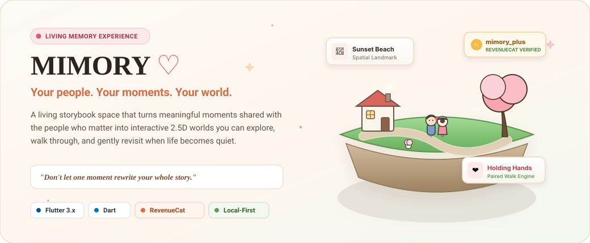
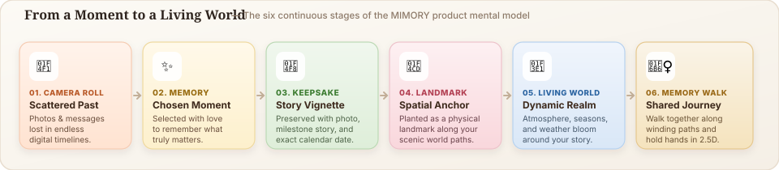
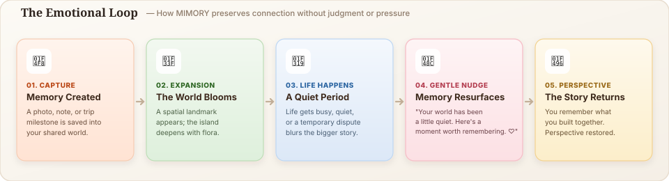
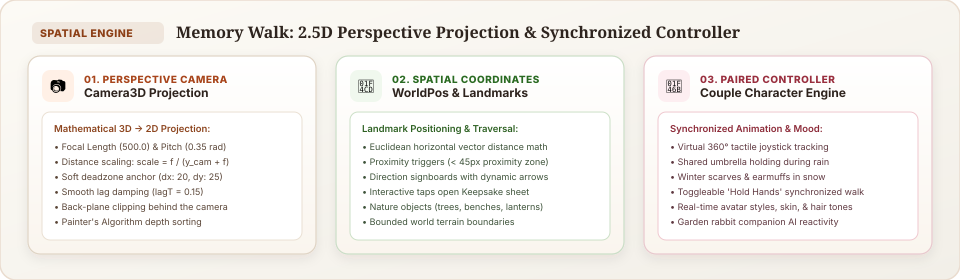
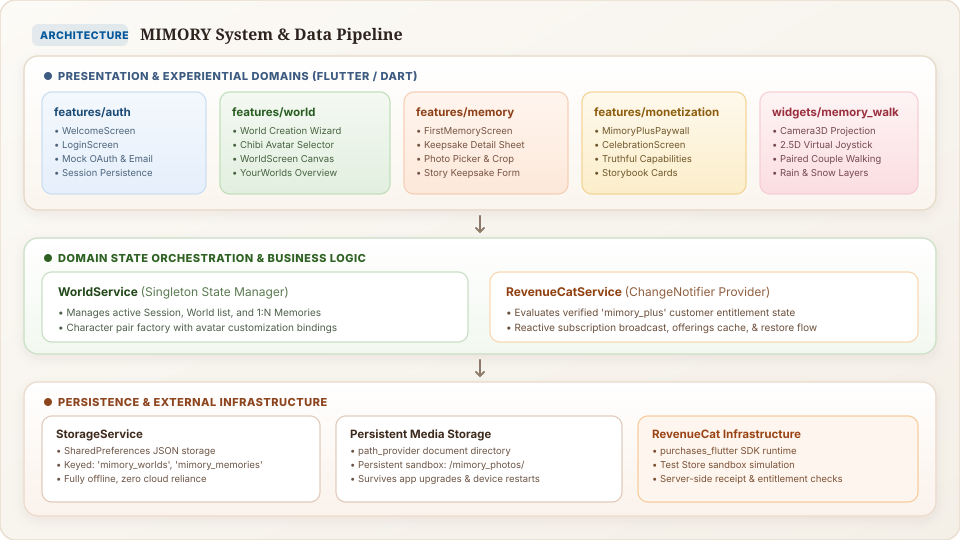
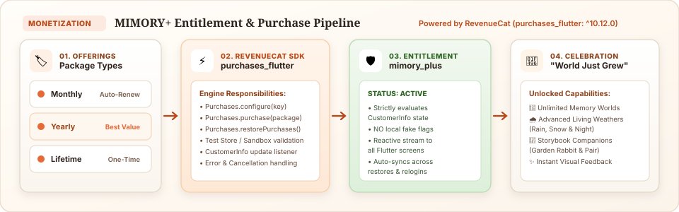
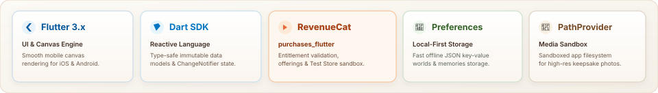

<div align="center">



<br/><br/>

### *MIMORY turns the moments you share with the people you love into little worlds you can revisit.*

<br/>

[**The Problem**](#sometimes-one-moment-makes-us-forget-all-the-others) • [**The Living World**](#what-if-your-memories-had-a-place-to-live) • [**Product Transformation**](#the-product-transformation) • [**Real Experience**](#the-core-product-experience) • [**The Emotional Loop**](#the-emotional-loop) • [**Memory Walk**](#signature-experience-memory-walk) • [**System Architecture**](#system-architecture) • [**RevenueCat Monetization**](#revenuecat-monetization--mimory) • [**Verification**](#verification--test-suite) • [**Quickstart**](#getting-started)

</div>

---

## Sometimes one moment makes us forget all the others.

We regularly keep memories of the people who matter to us.

Photos. Trips. Birthdays. Inside jokes. Messages. Small everyday moments.

Yet those memories usually end up scattered across camera rolls, endless chat histories, and forgotten folders.

And relationships naturally have quiet moments:
- Life gets busy.
- People move away.
- Communication slows down.
- Sometimes there is a small misunderstanding.

In those moments, it is easy to focus entirely on what is happening right now and temporarily forget the much larger story that came before it.

MIMORY is built around a simple thought:

> ### *What if the memories we already made could gently remind us of the bigger story?*

MIMORY does not judge the relationship.  
MIMORY does not diagnose conflict.  
MIMORY does not calculate relationship health.  

**MIMORY simply remembers with you.**

When a world becomes quiet, MIMORY can gently surface a meaningful memory from the past:

> *"Your world has been a little quiet. Here's a little moment worth remembering. ♡"*

The intention is not to pressure anyone. It is simply to remember the good that already exists.

---

## What if your memories had a place to live?

Instead of leaving memories trapped inside flat chronological lists, MIMORY gives each meaningful relationship its own dedicated, living world:

```
  Camera Roll  ──→  Living Storybook World
        Photo  ──→  Heartfelt Story Keepsake
       Memory  ──→  Interactive Physical Landmark
 Relationship  ──→  Dedicated World (Partner, Best Friend, Family)
     Timeline  ──→  Scenic Journey You Can Walk Through
```

When you create a world for someone important, you design customizable chibi avatars and choose an evocative storybook aesthetic (*Cozy Town*, *Starlit Forest*, *Blooming Meadow*, or *Sunlit Valley*).

As you add milestones and everyday moments, they take root as interactive physical landmarks along cobblestone walking paths.

---

## The Product Transformation

MIMORY transforms scattered digital files into a spatial, living sanctuary you can walk through together:

<br/>

<div align="center">
  
</div>

<br/>

```
  01. CAMERA ROLL   ──→  Photos and messages scattered across endless folders
  02. MEMORY        ──→  A meaningful moment chosen with intention and care
  03. KEEPSAKE      ──→  Preserved with photo, story vignette, and exact calendar date
  04. LANDMARK      ──→  Planted as an interactive physical anchor along walking paths
  05. LIVING WORLD  ──→  Atmospheric time of day, changing weather, and wildlife bloom
  06. MEMORY WALK   ──→  A shared 2.5D journey walked together holding hands
```

---

## The Core Product Experience

MIMORY guides you through five cohesive stages of relationship memory keeping:

<br/>

### 1. CREATE — Dedicated Relationship Worlds & Avatars
Create separate, personal worlds for each relationship (*Partner*, *Best Friend*, *Family*). Design customizable chibi avatars with individualized hairstyles, hair colors, skin tones, and outfits that represent you and your person.

```
  Welcome  ──→  Choose Relationship  ──→  Customize Avatars  ──→  Select Storybook Theme
```

### 2. KEEP — Keepsake Photos & Story Vignettes
Preserve milestones as photo keepsakes or written story vignettes. Photos are captured and persisted in app-controlled local sandbox storage (`/mimory_photos/`), surviving device restarts and operating system updates.

```
  Add Memory  ──→  Attach Photo  ──→  Write Milestone Note  ──→  Set Date  ──→  Save Keepsake
```

### 3. EXPLORE — Living World & 2.5D Memory Walk
Stroll through your world using a responsive 360° virtual joystick. Cobblestone paths wind past scenic landmarks, directional signposts point toward past milestones, and companion characters walk side-by-side with toggleable hand-holding.

```
  Enter World  ──→  Virtual Joystick  ──→  Follow Path  ──→  Hold Hands  ──→  Share Umbrella
```

### 4. REMEMBER — Landmark Reliving & Gentle Resurfacing
As you approach memory landmarks in the world, they illuminate with subtle proximity glows (< 45px). Tapping any landmark smoothly opens its keepsake sheet with the original photo, personal story, and calendar date. When a world has been quiet, MIMORY gently surfaces an older memory to restore perspective.

```
  Approach Landmark  ──→  Proximity Glow  ──→  Open Keepsake Sheet  ──→  Relive the Moment
```

### 5. GROW — MIMORY+ Entitlement Experience
Subscribing to MIMORY+ unlocks unlimited relationship worlds, dynamic living weather conditions (soothing rain, winter snowfall, starry night sky), and storybook garden companions (rabbit companions and paired wildlife).

```
  MIMORY+ Paywall  ──→  RevenueCat Purchase  ──→  Verified Entitlement  ──→  "World Just Grew"
```

<br/>

---

## The Emotional Loop

MIMORY's emotional loop is designed to protect perspective during quiet seasons without pressure, judgment, or surveillance:

<br/>

<div align="center">
  
</div>

<br/>

```
  A meaningful moment
          ↓
     saved in MIMORY
          ↓
     becomes part of the world
          ↓
     life continues
          ↓
    the world becomes quiet
          ↓
   MIMORY gently resurfaces an older memory
          ↓
     the bigger story comes back
          ↓
     remember what matters
```

MIMORY does not claim to fix relationships or enforce communication. It simply preserves what you have built together, so that in quiet times, the warmth of the bigger story is never lost.

---

## Signature Experience: Memory Walk

Instead of scrolling through your memories, **Memory Walk** lets you walk through them.

Memories become physical landmarks along scenic paths. Direction signposts point the way toward milestones, and both characters explore in real time—sharing an umbrella when it rains, wearing warm scarves in winter snow, or holding hands along the journey.

<br/>

<div align="center">
  
</div>

<br/>

### Under the Hood: Spatial Projection & Math

Memory Walk uses a custom programmatic canvas renderer built on Flutter's `CustomPainter`, designed for smooth mobile canvas rendering without heavy 3D asset bundles:

1. **3D Perspective Camera (`Camera3D`)**: Mathematically projects 3D world coordinates `(x, y, z)` into screen coordinates `(dx, dy)` using focal length (`500.0`) and pitch angles (`0.35 rad`), applying painter's algorithm depth sorting and distance scaling:
   $$\text{scale} = \frac{\text{focalLength}}{y_{\text{camera}} + \text{focalLength}}$$
2. **Smooth Follow with Soft Dead-Zone**: A cinematic camera dead-zone (`dx: 20`, `dy: 25`) absorbs small joystick micro-movements, preventing camera jitter while smoothly tracking characters via damped lag interpolation (`lagT = 0.15`).
3. **Synchronized Paired Controller**: Custom character models synchronize leg swing cycles, direction facing, shared umbrella holding during rain, and hand-holding positions based on 360° virtual joystick input.

---

## System Architecture

MIMORY is engineered as a local-first, modular Flutter application with strict domain separation, reactive service orchestration, and verified entitlement monetization:

<br/>

<div align="center">
  
</div>

<br/>

### Architectural Layers

- **Presentation & Feature Modules (`lib/features/`)**: Self-contained feature packages (`auth`, `world`, `memory`, `monetization`) managing screen lifecycles, user inputs, and navigation without coupling to data storage mechanisms.
- **Domain State Singletons (`lib/services/`)**: `WorldService` orchestrates active user session, world management, and 1:N memory relations. `RevenueCatService` evaluates verified entitlement streams.
- **Local-First Core & Media Sandbox (`StorageService`)**: `SharedPreferences` serializes structured JSON worlds and memories, while `path_provider` sandboxes high-resolution photos in `/mimory_photos/`, eliminating mandatory cloud dependencies.
- **Monetization Infrastructure (`purchases_flutter`)**: Official RevenueCat Flutter SDK handles offerings delivery, receipt verification, and entitlement evaluation.

---

## RevenueCat Monetization & MIMORY+

MIMORY integrates the official RevenueCat Flutter SDK (`purchases_flutter: ^10.12.0`) to power the **MIMORY+** premium experience for the RevenueCat Shipaton:

<br/>

<div align="center">
  
</div>

<br/>

### Monetization Engineering

- **Entitlement-Driven Access**: Premium status is strictly evaluated via RevenueCat's verified `CustomerInfo.entitlements['mimory_plus'].isActive`. Premium access is controlled by entitlement state, not a local boolean.
- **Truthful Capability Model (`MimoryPlusCapability`)**: Paywalls and celebration screens dynamically query `MimoryPlusCapability.unlockedForPlus`, presenting only genuinely implemented capabilities (`implemented == true`).
- **Reactive State Propagation**: `RevenueCatService` extends `ChangeNotifier`, broadcasting instant entitlement updates across the UI upon purchase or restore.
- **Sandbox & Test Store Ready**: Fully configured for instant sandbox and Test Store evaluation without requiring live App Store or Google Play merchant accounts.

---

## Engineering Decisions

### Local-First Persistence
- **What we did**: All worlds, memories, and photos persist locally on device via `SharedPreferences` and sandboxed document storage.
- **Why we did it**: Memories are deeply personal. The core experience does not require a cloud backend or account creation to create worlds, save memories, or revisit them.

### Strict 1:N World-Memory Isolation
- **What we did**: Every memory is bound to a persistent `worldId` using deterministic UUIDv4 identifiers.
- **Why we did it**: Guarantees that memories never leak between separate relationships (Partner, Best Friend, Family), maintaining absolute privacy and data integrity.

### Custom Canvas 2.5D Rendering
- **What we did**: Built a lightweight 2.5D perspective engine using Flutter's native `CustomPainter` and mathematical vector projection.
- **Why we did it**: Designed for smooth mobile canvas rendering on iOS and Android without the overhead, download size, and battery drain of heavy 3D game engines.

### Clean Service Boundaries
- **What we did**: Services expose clean async interfaces (`createWorld`, `purchasePackage`, `persistPhoto`) and emit reactive notifications via `ChangeNotifier`.
- **Why we did it**: Keeps UI widgets completely decoupled from storage mechanisms, SDK implementation details, and network lifecycles.

---

## Data Model

MIMORY enforces a clean, deterministic relational model between worlds, memories, and customized characters:

```
 ┌───────────────────────────────────┐
 │               World               │
 ├───────────────────────────────────┤
 │ id: String (UUID)                 │
 │ name: String                      │
 │ relationshipType: String          │  (Partner | Best Friend | Family)
 │ personName: String                │
 │ nickname: String?                 │
 │ userAvatarId: String              │
 │ companionAvatarId: String         │
 │ worldStyle: String                │  (Cozy Town | Forest | Meadow | Valley)
 │ createdAt: DateTime               │
 └─────────────────┬─────────────────┘
                   │
                   │ 1 : N (via worldId)
                   ▼
 ┌───────────────────────────────────┐       ┌───────────────────────────────────┐
 │              Memory               │       │             Character             │
 ├───────────────────────────────────┤       ├───────────────────────────────────┤
 │ id: String (UUID)                 │       │ id: String                        │
 │ worldId: String                   │◄──────┤ worldId: String                   │
 │ type: MemoryType (photo | story)  │       │ personName: String                │
 │ title: String                     │       │ hairStyle: String                 │
 │ description: String               │       │ hairColor: Color                  │
 │ imagePath: String?                │       │ skinTone: Color                   │
 │ memoryDate: DateTime              │       │ outfitColor: Color                │
 │ createdAt: DateTime               │       │ isCurrentUser: bool               │
 └───────────────────────────────────┘       └───────────────────────────────────┘
```

---

## Technology

<br/>

<div align="center">
  
</div>

<br/>

| Layer | Technology | Architectural Rationale |
|---|---|---|
| **Framework** | Flutter 3.x / Dart SDK | Cross-platform codebase designed for smooth mobile canvas rendering on iOS and Android. |
| **Monetization** | RevenueCat (`purchases_flutter: ^10.12.0`) | Verified entitlement evaluation, offerings delivery, and cross-platform purchase handling. |
| **Local Persistence** | `shared_preferences: ^2.5.5` | Fast, lightweight local key-value persistence for structured JSON worlds, memories, and sessions. |
| **Document Storage** | `path_provider: ^2.1.6` | App-controlled sandboxed document directory for persistent keepsake photo storage. |
| **Typography** | `google_fonts: ^6.2.1` | Curated storybook typography pairing Playfair Display headings with Plus Jakarta Sans body copy. |
| **Media Capture** | `image_picker: ^1.0.7` | Native gallery image selection with safe sandbox persistence. |
| **Identity** | `uuid: ^4.3.3` | Cryptographically secure UUIDv4 generation for deterministic entity relationships. |

---

## Project Structure

```
lib/
├── core/
│   ├── theme/               # Storybook typography, color palettes, elevation tokens
│   └── widgets/             # Tactile buttons, text fields, cards, branding icons
├── features/
│   ├── auth/                # Welcome screen, mock session persistence
│   ├── memory/              # Keepsake creation wizard, photo picker, detail sheet
│   ├── monetization/        # MIMORY+ paywall, celebration screen, capability cards
│   └── world/               # World creation wizard, avatar selector, world overview
├── models/
│   ├── avatar_definition.dart     # Preset chibi avatar profiles and palettes
│   ├── character.dart             # Living character state (hair, skin, outfit)
│   ├── memory.dart                # Photo and story keepsake data models
│   ├── mimory_plus_capability.dart# Truthful monetization capability catalog
│   ├── user_session.dart          # Local session and authentication identity
│   ├── world.dart                 # World metadata, style, and companion bindings
│   ├── world_environment_config.dart # Atmospheric lighting, time, season tokens
│   └── world_point.dart           # 3D spatial vector and distance math
├── services/
│   ├── revenue_cat_config.dart    # SDK configuration and entitlement identifiers
│   ├── revenue_cat_service.dart   # Purchases SDK singleton & entitlement stream
│   ├── storage_service.dart       # SharedPreferences and document directory storage
│   └── world_service.dart         # Core application state manager
├── widgets/
│   ├── anime_character_widget.dart# CustomPainter storybook character renderer
│   ├── couple_character_pair_widget.dart # Paired couple walking & hand holding
│   └── memory_walk/               # 3D perspective terrain, camera, landmarks, animals
└── main.dart                # Application bootstrap & service initialization
```

---

## Verification & Test Suite

MIMORY maintains an automated test suite verifying data persistence, memory boundary isolation, 3D camera projection, atmospheric weather algorithms, and RevenueCat integration:

```
test/
├── product_functionality_test.dart   # World/memory persistence, session isolation, routing (8 tests)
├── living_world_test.dart            # Time-of-day/season algorithms, ambient weather layers (12 tests)
├── stable_memory_walk_test.dart      # Memory Walk joystick, hand holding, signboard constraints (3 tests)
├── third_person_world_test.dart      # Camera3D perspective math, deadzone follow, depth sorting (8 tests)
├── revenue_cat_service_test.dart     # Entitlement matching, singleton consistency, capability truthfulness (5 tests)
└── widget_test.dart                  # App bootstrap and smoke test (1 test)
```

### Verified Test Results

```
$ flutter analyze
Analyzing mimory...
No issues found! (ran in 13.4s)

$ flutter test
✓ test/living_world_test.dart: All 12 tests passed!
✓ test/product_functionality_test.dart: All 8 tests passed!
✓ test/revenue_cat_service_test.dart: All 5 tests passed!
✓ test/third_person_world_test.dart: All 8 tests passed!
✓ test/stable_memory_walk_test.dart: All 3 tests passed!
✓ test/widget_test.dart: All 1 tests passed!
────────────────────────────────────────────────────────
✓ 37 / 37 tests passed
```

### What the Tests Protect
- **Persistence & Isolation**: Confirms that memories and worlds are saved with stable identifiers and never cross-contaminate separate relationships.
- **Memory Walk Spatial Engine**: Validates Camera3D coordinate projection, dead-zone lag interpolation, signboard constraints, and hand-holding toggles.
- **Living Atmosphere**: Validates atmospheric lighting, weather particle layer rendering (rain and snow), and shared accessory logic.
- **RevenueCat Integration**: Validates entitlement matching for `mimory_plus`, singleton consistency, and that only genuinely implemented capabilities appear in the paywall.

---

## Current Status

To ensure complete transparency and trustworthiness, here is the verified status of each capability in the repository:

| Capability / Component | Implementation Status | Notes |
|---|---|---|
| **Flutter Mobile App** | ✓ Implemented | Built with Flutter 3.x & Dart |
| **World Creation & Avatars** | ✓ Implemented | 4 world styles, customizable avatar pairs |
| **Keepsake Memory Storage** | ✓ Implemented | Photos & written stories with persistent local storage |
| **Interactive Memory Walk** | ✓ Implemented | 2.5D perspective terrain, virtual joystick, paired couple walk |
| **Living Atmosphere** | ✓ Implemented | Time cycles, rain with shared umbrella, winter snow, fireflies |
| **RevenueCat MIMORY+ Flow** | ✓ Implemented | Monthly, Yearly, Lifetime packages & verified entitlement checks |
| **RevenueCat Test Store** | ◐ Configured | Ready for sandbox evaluation |
| **Cloud Synchronization** | → Planned | Current architecture is local-first |
| **Audio Memory Echoes** | → Planned | Roadmap capability explicitly tagged in capability model |

---

## Getting Started

### Prerequisites
- [Flutter SDK](https://docs.flutter.dev/get-started/install) (matching Dart SDK `^3.13.3`)
- Android Studio / Xcode (for device deployment or simulators)

### Installation

```bash
# 1. Clone the repository
git clone https://github.com/Noufalthecoder/mimory.git
cd mimory

# 2. Install dependencies
flutter pub get

# 3. Run automated tests to verify your environment
flutter test

# 4. Launch the application
flutter run
```

---

## RevenueCat Setup & Sandbox Testing

MIMORY is ready out-of-the-box for evaluation with RevenueCat.

### Testing Purchases in Sandbox / Test Store:
1. Launch MIMORY on a physical device or emulator.
2. Tap the **MIMORY+** button in the header or world screen.
3. Select any offering (**Monthly**, **Yearly**, or **Lifetime**).
4. Complete the transaction using RevenueCat's sandbox/test sheet.
5. The application immediately evaluates the verified `mimory_plus` entitlement and transitions into the **"Your little world just grew. ♡"** celebration screen.

### Configuring Your Own RevenueCat Project:
1. Create a project at [app.revenuecat.com](https://app.revenuecat.com).
2. Create an Entitlement with identifier `mimory_plus`.
3. Set up your products and attach them to a default offering.
4. Add your public SDK keys in `lib/services/revenue_cat_config.dart`.

---

## Privacy & Data Handling

- **Local-First Storage**: MIMORY is currently local-first. All world details, memory photos, notes, and avatars are stored locally on your device.
- **Media Sandbox**: Photos are saved in the app-controlled local document directory, isolated from external app access.
- **No Third-Party Ad Trackers**: Photos and personal stories are not shared with advertising networks.
- **Secure Purchases**: Subscription receipts and customer info are validated securely through RevenueCat and official platform payment channels.

---

## License

This project is created for evaluation and personal memory keeping. All rights reserved.
